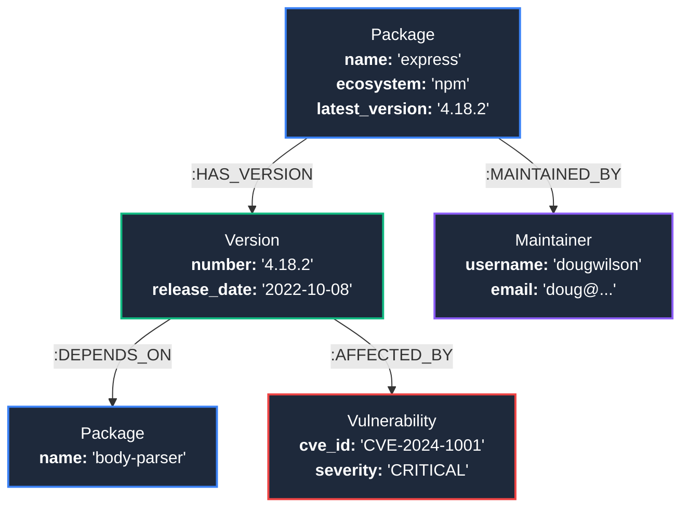

# 🕸️ DepGraph — Package Dependency & Vulnerability Blast Radius Explorer

> A graph-native web application for exploring npm dependency trees, discovering security vulnerability blast radius, and analyzing supply-chain risk — powered by **CognoDB Cloud** and **Neo4j**.


---

## 🌐 Live Demo & Deliverables

- **🚀 Hosted Application Demo**: `https://cogno-db-dep-graph.vercel.app` (or your deployed link)
- **📹 Screen Recording Demo**: `https://youtu.be/example` (or Loom/Drive link)
- **📦 GitHub Repository**: `https://github.com/Vamshi7x/DepGraph`

---

## 💡 Why a Graph Database?

Relational databases store data in tabular rows and columns. While relational DBs work well for simple lookups, software supply chains are inherently **graph-structured networks**:

1. **Recursive Dependency Traversals**: Finding transitive dependencies in SQL requires recursive Common Table Expressions (CTEs) or deep nested `JOIN`s that degrade in performance exponentially as hop depth increases ($O(N^k)$). In CognoDB, graph connections are traversed via index-free adjacency ($O(k)$ pointer navigation).
2. **Vulnerability Blast Radius Analysis**: Answering *"If package X has a CVE, which downstream applications across 6 degrees of separation are exposed?"* requires variable-length path pattern matching (`[:DEPENDS_ON*1..6]`). Graph databases evaluate this naturally in milliseconds.
3. **Shortest Path & Shared Risk**: Calculating the shortest dependency bridge between two packages or finding single-maintainer bottlenecks across hundreds of packages is a native graph operation (`shortestPath`), whereas SQL multi-table joins for arbitrary path discovery are slow and complex.
4. **Flexible & Evolving Schema**: Relationships like `:DEPENDS_ON`, `:MAINTAINED_BY`, and `:AFFECTED_BY` can be added and connected dynamically without costly table alter scripts or complex join tables.

---

## 📊 Graph Data Model

The application models software packages, versions, maintainers, and vulnerabilities as a directed graph:



### Node Labels & Properties
- **`:Package`**: `{ name: String, ecosystem: String, description: String, latest_version: String }`
- **`:Version`**: `{ number: String, package: String, release_date: String }`
- **`:Maintainer`**: `{ username: String, email: String }`
- **`:Vulnerability`**: `{ cve_id: String, severity: String, description: String, published_date: String }`

### Relationship Types
- `(:Package)-[:HAS_VERSION]->(:Version)`
- `(:Version)-[:DEPENDS_ON]->(:Package)`
- `(:Package)-[:MAINTAINED_BY]->(:Maintainer)`
- `(:Version)-[:AFFECTED_BY]->(:Vulnerability)`

---

## 🏗️ Architecture

```
┌─────────────────┐       REST API       ┌─────────────────┐      Bolt 5.x      ┌─────────────────┐
│    Frontend     │ ◄──────────────────► │     Backend     │ ◄────────────────► │     CognoDB     │
│   React 19 +    │      :3001/api       │ Node.js/Express │  bolt+s://...      │ Cloud Database  │
│      Vite       │                      │  neo4j-driver   │                    │                 │
│                 │                      │                 │                    │ • Package       │
│ • Home          │                      │ /api/packages   │                    │ • Version       │
│ • Package Detail│                      │ /api/blast-     │                    │ • Maintainer    │
│ • Blast Radius  │                      │   radius        │                    │ • Vulnerability │
│ • Compare       │                      │ /api/path       │                    │                 │
│ • Interactive   │                      │ /api/shared     │                    │ DEPENDS_ON      │
│   Graph View    │                      │ /api/stats      │                    │ MAINTAINED_BY   │
└─────────────────┘                      └─────────────────┘                    └─────────────────┘
```

---

## ☁️ Setting Up CognoDB Cloud

1. **Sign Up**: Go to [https://console.cognodb.com/signup](https://console.cognodb.com/signup) and create a free account (no credit card required).
2. **Provision Instance**: From the console, click **Create Instance** and pick the free `c0` tier. Provisioning completes in under 60 seconds.
3. **Save Credentials**:
   - Copy your database Connection URI: `bolt+s://<instance-id>.databases.cognodb.cloud`
   - Copy the generated password for user `cognodb` (shown only once!).
4. **Configure Environment Variables**:
   In `backend/.env`, set:
   ```env
   BOLT_URI=bolt+s://<instance-id>.databases.cognodb.cloud
   BOLT_USER=cognodb
   BOLT_PASSWORD=<your-saved-password>
   PORT=3001
   ```

---

## 🚀 Quick Start

### 1. Clone Repository & Install Dependencies

```bash
# Clone the repository
git clone https://github.com/Vamshi7x/DepGraph.git
cd DepGraph

# Install backend dependencies
cd backend
npm install

# Install frontend dependencies
cd ../frontend
npm install
```

### 2. Configure Environment

```bash
cd backend
cp .env.example .env
# Edit .env with your CognoDB credentials
```

### 3. Seed Database with Real npm Data

```bash
cd backend
npm run seed
```

*The seed script fetches live metadata from the public npm registry for ~50 popular packages + transitive dependencies and bulk loads node/relationship batches via Cypher `UNWIND` statements.*

### 4. Run Application Locally

```bash
# Terminal 1: Start Backend Server
cd backend
npm run dev

# Terminal 2: Start Frontend Application
cd frontend
npm run dev
```

Open **http://localhost:5173** in your browser.

---

## 🔑 Key Cypher Queries Explained

All queries use **parameterized Cypher** via `neo4j-driver` to guarantee safety against injection attacks.

### 1. Multi-Hop Blast Radius (Headline Traversal)
Finds all packages affected up to 6 degrees of transitive dependency separation if a package develops a critical vulnerability:
```cypher
MATCH (vulnerable:Package {name: $packageName})
MATCH path = (affected:Package)-[:HAS_VERSION]->(:Version)-[:DEPENDS_ON*1..6]->(vulnerable)
WITH DISTINCT affected, length(path) - 1 AS hops
RETURN affected.name AS package, 
       affected.description AS description,
       hops
ORDER BY hops
```

### 2. Shortest Dependency Path
Calculates the shortest chain of dependencies connecting any two arbitrary packages:
```cypher
MATCH (a:Package {name: $from}), (b:Package {name: $to})
MATCH path = shortestPath((a)-[:HAS_VERSION|DEPENDS_ON*..15]->(b))
RETURN [n IN nodes(path) WHERE n:Package | n.name] AS chain,
       length(path) AS totalHops
```

### 3. Circular Dependency Detection
Identifies cyclic dependency loops that risk build breaks or runtime initialization locks:
```cypher
MATCH path = (p:Package)-[:HAS_VERSION]->(:Version)-[:DEPENDS_ON*2..8]->(p)
RETURN [n IN nodes(path) WHERE n:Package | n.name] AS cycle
LIMIT 10
```

### 4. Single-Maintainer Risk Analysis
Detects maintainers who maintain multiple packages that major parts of the ecosystem depend on:
```cypher
MATCH (m:Maintainer)<-[:MAINTAINED_BY]-(p:Package)<-[:DEPENDS_ON]-(:Version)<-[:HAS_VERSION]-(dependent:Package)
WITH m, collect(DISTINCT p.name) AS packages, count(DISTINCT dependent) AS totalDependents
WHERE size(packages) >= 2
RETURN m.username AS maintainer,
       packages,
       totalDependents
ORDER BY totalDependents DESC
LIMIT 10
```

---

## 🖼️ User Interface & Features

- **🔍 Intelligent Package Search**: Live search with autocomplete across npm ecosystem nodes.
- **📊 Interactive Force-Directed Canvas**: Visual graph node expansion, zoom, drag, and relation highlights (`react-force-graph-2d`).
- **💥 Blast Radius Explorer**: Interactive simulator demonstrating downstream impact when a target package is compromised.
- **🔀 Path & Shared Dependency Comparison**: Side-by-side package analysis for path traversal and overlapping dependencies.
- **🛡️ Vulnerability Badges & Status**: Live CVE severity mapping (CRITICAL, HIGH, MEDIUM, LOW).
- **⚡ Error & Loading UI States**: Skeleton loading states and graceful database retry banners when offline.

---

## 📁 Project Structure

```
DepGraph/
├── backend/
│   ├── src/
│   │   ├── config/          # Environment configuration
│   │   ├── db/              # Neo4j driver & session management
│   │   ├── queries/         # Parameterized Cypher query library
│   │   └── routes/          # Express API route handlers
│   ├── scripts/
│   │   └── seed.js          # npm registry loader & seed script
│   ├── .env.example         # Environment template
│   └── server.js            # Express application entry point
├── frontend/
│   ├── src/
│   │   ├── components/      # Graph canvas, search, skeleton loaders, banners
│   │   ├── pages/           # Home, Detail, Blast Radius, Compare
│   │   ├── styles/          # Design tokens & dark glassmorphism CSS
│   │   └── utils/           # API fetch client
│   ├── vercel.json          # Deployment config
│   └── vite.config.js       # Vite build config
└── README.md
```

---

## 📧 Submission

- **Submitted to**: `hr@wexa.ai`
- **Subject**: `CognoDB Assignment 2 – Vamshi`
